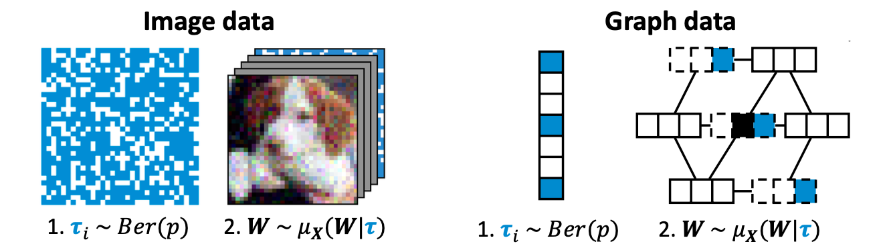

# Hierarchical Randomized Smoothing



Reference implementation of the robustness certificate proposed in the paper:

**<a href='https://openreview.net/pdf?id=6IhNHKyuJO'>Hierarchical Randomized Smoothing</a>**<br>
*Yan Scholten, Jan Schuchardt, Aleksandar Bojchevski, Stephan Günnemann*<br>
Conference on Neural Information Processing Systems (NeurIPS), 2023<br>
[ <a href='https://www.cs.cit.tum.de/daml/hierarchical-smoothing/'>Project page</a> | <a href='https://openreview.net/pdf?id=6IhNHKyuJO'>PDF</a> | <a href='https://nips.cc/virtual/2023/poster/72764'>Talk</a> | <a href='https://yascho.github.io/assets/pdf/scholten2023hierarchical-slides.pdf'>Slides</a> | <a href='https://yascho.github.io/assets/pdf/scholten2023hierarchical-poster.pdf'>Poster</a> ]

## Examples

We provide two demo notebooks with examples of 
how to compute hierarchical smoothing certificates 
for images (<a href="./notebooks/demo-images.ipynb">demo-images.ipynb</a>) 
and graphs (<a href="./notebooks/demo-graphs.ipynb">demo-graphs.ipynb</a>).

We also provide pretrained models for efficient demonstration. If you want to use the pretrained ResNet50 model, execute the following:

```
wget --show-progress -qO data/precomputed/pretrained_ResNet50_CIFAR10.pt https://www.dropbox.com/scl/fi/el5onf6nha1wb16ro7e8h/pretrained_ResNet50_CIFAR10.pt?rlkey=xac8by8b7blz88st1a7h7e1nz
```

You can also manually download the file [here](https://www.dropbox.com/scl/fi/el5onf6nha1wb16ro7e8h/pretrained_ResNet50_CIFAR10.pt?rlkey=xac8by8b7blz88st1a7h7e1nz&dl=0).

## Install

Instructions to install required dependencies:

```
python -m venv hs 
source hs/bin/activate
pip install -r requirements.txt
pip install .
```

The code was tested with Python 3.10.8, Pip 23.3.2, PyTorch 1.13.1+cu116, PyTorch-Geometric 2.2.0, and CUDA 11.6 on NVIDIA GeForce GTX 1080 Ti.

## Usage

To compute robustness certificates systematically on a cluster we provide [seml](https://github.com/TUM-DAML/seml) scripts:

**For images**:
```
export CUBLAS_WORKSPACE_CONFIG=:4096:8 # for reproducibility
seml hs add configs/images/*.yaml
seml hs start
```

**For graphs**:
```
export CUBLAS_WORKSPACE_CONFIG=:4096:8 # for reproducibility
seml hs add configs/graphs/*.yaml
seml hs start
```

We assume the following folder structure:

```
hierarchical_smoothing
├── configs
│   ├── graphs
│   │   ├── ablation.yaml
│   │   ├── hierarchical.yaml
│   │   ├── sparse.yaml
│   │   └── unprotected.yaml
│   └── images
│       ├── ablation.yaml
│       ├── gaussian.yaml
│       ├── hierarchical.yaml
│       └── unprotected.yaml
├── data
│   ├── graphs
│   │   └── cora_ml.npz
│   ├── images
│   └── seeds.pt
├── hierarchical_smoothing
├── results
│   ├── graphs
│   └── images
```

The computed robustness certificates will be stored in the results folder.

## Cite
Please cite our paper if you use this code in your own work:

```
@inproceedings{scholten2023hierarchical,
title={Hierarchical Randomized Smoothing},
author={Yan Scholten and Jan Schuchardt and Aleksandar Bojchevski and Stephan G{\"u}nnemann},
booktitle={Advances in Neural Information Processing Systems, {NeurIPS}},
year={2023}
}
```

## Contact

For questions and feedback please contact:

Yan Scholten, Technical University of Munich<br>
Jan Schuchardt, Technical University of Munich<br>
Aleksandar Bojchevski, University of Cologne, Germany<br>
Stephan Günnemann, Technical University of Munich

## License

The code by Yan Scholten, Jan Schuchardt, Aleksandar Bojchevski and Stephan Günnemann is licensed under MIT license.
